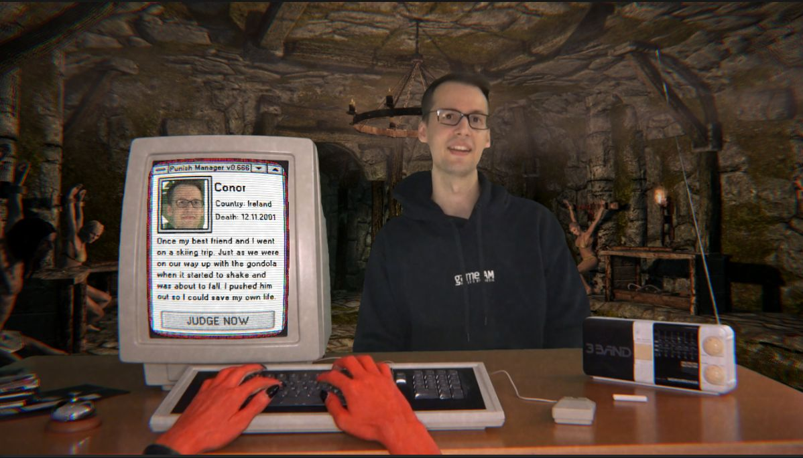

# Judgement Monday

A #klujam22 game about punishing sinners as the devil himself.

You are the devil going about your daily duties punishing new arrivals in hell. One by one, the poor souls arrive at your devilish desk and plead their case. Now you have to decide their fate: choose how they should be punished from this month's torture list. Choose wisely - your decision is for eternity.

The selected punishments are stored (anonymously!) online, allowing you to compare your evilness to others.

Made during the [9th Klagenfurt Game Jam](https://klujam.at/) by a team of weird devils-to-be, with the help of a bunch of lovely sinners also participating in the event.

### [Play on itch.io](https://kruemelkatze.itch.io/judgement-monday)

### Gameplay Video and Screenshots

Gameplay Video by **ezez game**:

[ ](Images/2.jpg)

[ ](Images/4.jpg)

